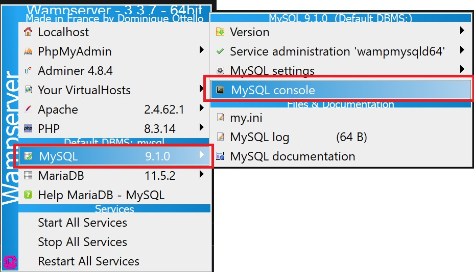
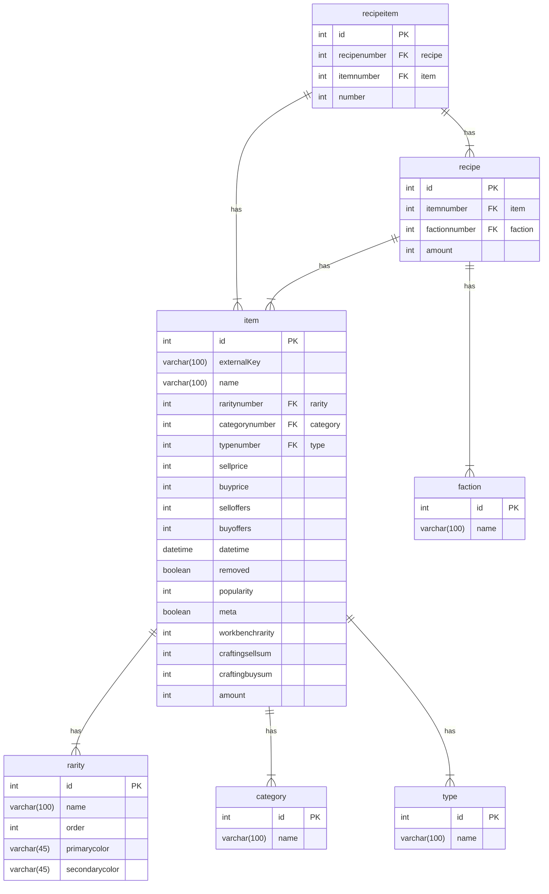

Contributing
===

**This readme currently only covers some basics, please join our Discord channel if you need any help, with setting everything up properly.**

You will need a few things to setup first:

* MySQL Server 9.x
* Visual Studio with .Net 4.8 installed
* Some experience with Web Development

## Setup the MySQL server

Windows users can install [WampServer]<https://www.wampserver.com/en/>, which already includes a `MySQL` server and `phpMyAdmin` (web UI to manage the DB).

Launch the server and wait for its initialization. Once done, left-click on the its icon in the nav bar and open the MySQL console as shown in the following picture.



Enter `root` as username and press enter when asked for a password (default root user has no password by default).

Create a new database and a new user:

```bash
mysql> CREATE DATABASE crossout_market;
mysql> CREATE USER 'crossout'@'localhost' IDENTIFIED BY 'crossout';
mysql> GRANT ALL PRIVILEGES ON crossout_market.* TO 'crossout'@'localhost';
mysql> FLUSH PRIVILEGES;
```

Fork and clone this repository. You will need to import the database schema and data from the file `/Schema/crossout_structure_and_data_no_market.sql`.

Option 1: run the following commands from the MySQL console

```bash
mysql> USE crossout_market;
mysql> SOURCE {absolute path to the .sql file};
```

Option 2:

* Open `phpMyAdmin` at <http://localhost/phpmyadmin/index.php>
* Login with username=crossout and password=crossout
* Click on the database `crossout_market`
* Go to `Import` and select the `.sql` file

## Setup the IDE

Install and run Visual Studio.

Create the settings file in `%appdata%/CrossoutWeb/WebSettings.json` or start the project file at `Crossout.AspWeb\Crossout.AspWeb.csproj` once since this will automatically create the file. The file should look like this:

```json
{
  "CurrentVersion": "0.7.0",
  "DatabaseName": "crossout",
  "DatabaseHost": "localhost",
  "DatabasePassword": "your db password",
  "DatabaseUsername": "your db username",
  "DatabasePort": 3306,
  "SignalrHost": "localhost",
  "WebserverPort": 80,
  "DataHost": "localhost",
  "GoogleConsumerKey": "",
  "GoogleConsumerSecret": "",
  "EnableAds": false,
  "FileCarEditorWeaponsExLua": "Resources\\Data\\0.7.0\\gamedata\\def\\ex\\car_editor_weapons_ex.lua",
  "FileCarEditorCabinsLua": "Resources\\Data\\0.7.0\\gamedata\\def\\ex\\car_editor_cabins.lua",
  "FileCarEditorDecorumLua": "Resources\\Data\\0.7.0\\gamedata\\def\\ex\\car_editor_decorum.lua",
  "FileCarEditorWheelsLua": "Resources\\Data\\0.7.0\\gamedata\\def\\ex\\car_editor_wheels.lua",
  "FileCarEditorCoreLua": "Resources\\Data\\0.7.0\\gamedata\\def\\ex\\car_editor_core.lua",
  "FileStringsEnglish": "Resources\\Data\\0.7.0\\strings\\english\\string.txt",
  "DirectoryPremiumPackages": "Resources\\PremiumPackages",
  "DirectoryKnightRiders": "Resources\\Events\\KnightRiders",
  "FileContributors": "Resources\\Info\\contributors.json",
  "FileUpdateNotes": "Resources\\Info\\updates.json"
}
```

Replace the database configuration with the correct ones. If you followed the previous steps, replace the configuration with:

```json
  "DatabaseName": "crossout_market",
  "DatabaseHost": "localhost",
  "DatabasePassword": "crossout",
  "DatabaseUsername": "crossout",
  "DatabasePort": 3306,
```


## Entity relation model for items and recipes



## Recipe-item relation

The `recipe` with id 1 describe the crafting of the item with id 61 (Little Boy 6LB). The craft ingredients are stored in the table `recipeitems`, and they are:

- id 53 (Scrap Metal x650)
- id 43 (Copper x130)
- id 99 (Avenger 57mm x1)
- id 139 (Fuel barrel x1)

### recipe

|id|itemnumber|factionnumber|amount|
|-|-|-|-|
|1|61|1|1|

### item

|id|externalKey|name|
|-|-|-|
|61|CarPart_Gun_BigCannon_Free_rare|Little Boy 6LB|
|43|Res_Platinum_100|Copper x100|
|53|Res_Scrap_Common_100|Scrap Metal x100|
|99|CarPart_Gun_BigCannon_EX|Avenger 57mm|
|139|CarPart_Barrel|Fuel barrel|

### recipeitem

|id|recipenumber|itemnumber|number|
|-|-|-|-|
|1|1|53|650|
|2|1|43|130|
|3|1|99|1|
|4|1|139|1|