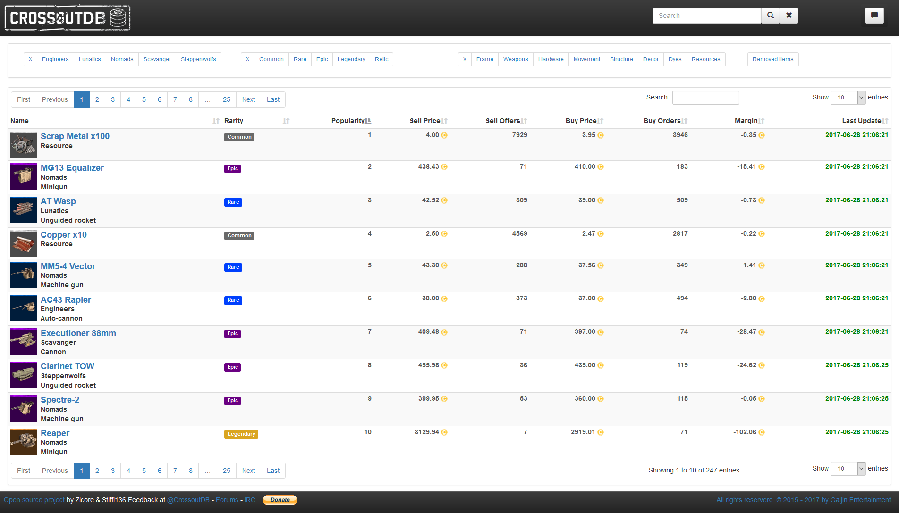
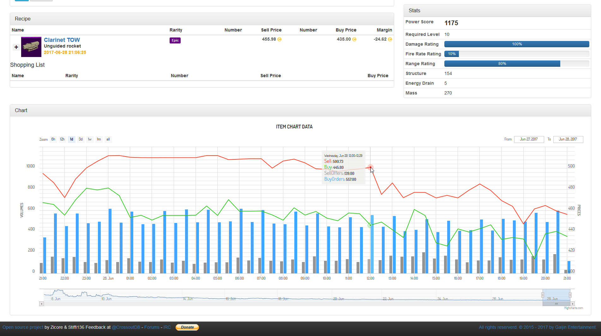
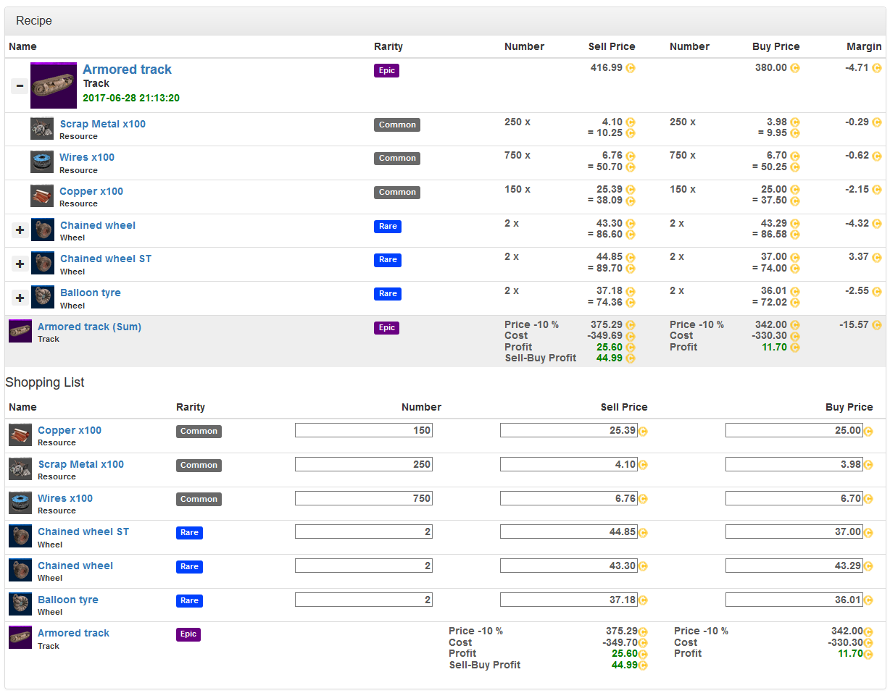
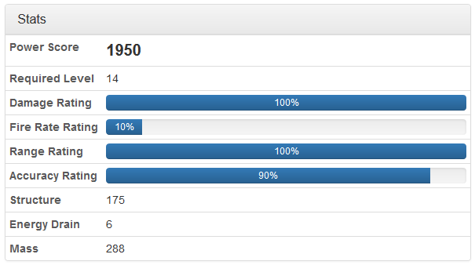

Crossout DB
===

# Disclaimer

We are not affiliated with Gaijin or Targem games in any way. We are just two guys with a passion for markets and games :smile:

# Readme Update: 2019-05-24

A few months ago, when a Crossout patch encrypted the game files, we contacted the developers of Crossout and we got in touch whit each other. They worked with us to provide a very basic, private API to get the current market data every ~5 min. This enabled us to continue this project.

Crafting Calculator, Price Graphs, Margins and more
===

This is the Open Source Project for Crossout Market found here: <http://crossoutdb.com/> it provides out of game prices, buy and sell offers as well as price and volume graphs. Also new are item stats, item descriptions, filters and improved usage of [datatables](https://datatables.net/).

Screenshot of the main page:



Example of the Clarinet Tow item page:



Example of recipe view:



Example of stats view:



Contributing
===

**This readme currently only covers some basics, please join our Discord channel if you need any help, with setting everything up properly.**

You will need a few things to setup first:

* MySQL Server 9.x
* Visual Studio with .Net 4.8 installed
* Some experience with Web Development

## Setup the MySQL server

Windows users can install [WampServer]<https://www.wampserver.com/en/>, which already includes a `MySQL` server and `phpMyAdmin` (web UI to manage the DB).

Launch the server and wait for its initialization. Once done, left-click on the its icon in the nav bar and open the MySQL console as shown in the following picture.


Enter `root` as username and press enter when asked for a password (default root user has no password by default).

Create a new database and a new user:

```bash
mysql> CREATE DATABASE crossout_market;
mysql> CREATE USER 'crossout'@'localhost' IDENTIFIED BY 'crossout';
mysql> GRANT ALL PRIVILEGES ON crossout_market.* TO 'crossout'@'localhost';
mysql> FLUSH PRIVILEGES;
```

Fork and clone this repository. You will need to import the database schema and data from the file `/Schema/crossout_structure_and_data_no_market.sql`.

Option 1: run the following commands from the MySQL console

```bash
mysql> USE crossout_market;
mysql> SOURCE {absolute path to the .sql file};
```

Option 2:

* Open `phpMyAdmin` at <http://localhost/phpmyadmin/index.php>
* Login with username=crossout and password=crossout
* Click on the database `crossout_market`
* Go to `Import` and select the `.sql` file

## Setup the IDE

Install and run Visual Studio.

Create the settings file in `%appdata%/CrossoutWeb/WebSettings.json` or start the project file at `Crossout.AspWeb\Crossout.AspWeb.csproj` once since this will automatically create the file. The file should look like this:

```json
{
  "CurrentVersion": "0.7.0",
  "DatabaseName": "crossout",
  "DatabaseHost": "localhost",
  "DatabasePassword": "your db password",
  "DatabaseUsername": "your db username",
  "DatabasePort": 3306,
  "SignalrHost": "localhost",
  "WebserverPort": 80,
  "DataHost": "localhost",
  "GoogleConsumerKey": "",
  "GoogleConsumerSecret": "",
  "EnableAds": false,
  "FileCarEditorWeaponsExLua": "Resources\\Data\\0.7.0\\gamedata\\def\\ex\\car_editor_weapons_ex.lua",
  "FileCarEditorCabinsLua": "Resources\\Data\\0.7.0\\gamedata\\def\\ex\\car_editor_cabins.lua",
  "FileCarEditorDecorumLua": "Resources\\Data\\0.7.0\\gamedata\\def\\ex\\car_editor_decorum.lua",
  "FileCarEditorWheelsLua": "Resources\\Data\\0.7.0\\gamedata\\def\\ex\\car_editor_wheels.lua",
  "FileCarEditorCoreLua": "Resources\\Data\\0.7.0\\gamedata\\def\\ex\\car_editor_core.lua",
  "FileStringsEnglish": "Resources\\Data\\0.7.0\\strings\\english\\string.txt",
  "DirectoryPremiumPackages": "Resources\\PremiumPackages",
  "DirectoryKnightRiders": "Resources\\Events\\KnightRiders",
  "FileContributors": "Resources\\Info\\contributors.json",
  "FileUpdateNotes": "Resources\\Info\\updates.json"
}
```

Replace the database configuration with the correct ones. If you followed the previous steps, replace the configuration with:

```json
  "DatabaseName": "crossout_market",
  "DatabaseHost": "localhost",
  "DatabasePassword": "crossout",
  "DatabaseUsername": "crossout",
  "DatabasePort": 3306,
```

CrossoutDB API
===
Our API provides all data we have gathered so far, in an easy to use form.

# Current API Version 1

## General Information about the API

The API provides Json formatted data models and are as self-explanatory as possible, if you have any questions you can join our Discord channel and we try to help.

All API endpoints currently use GET.

Even though the API is versioned, it can still change at any time without further notice. Hopefully there will be only fixes, but you have been warned :)

Do you have Ideas for more endpoints? Join our Discord or make an issue on our Github repository to tell us :)

## Base URL

```
/api/v1/
```

## Rarities

Results a list of all rarities

```
/api/v1/rarities
```

## Factions

Results a list of all factions

```
/api/v1/factions
```

## Types

Results a list of all types

```
/api/v1/types
```

## Categories

Results a list of all categories

```
/api/v1/categories
```

## Items

Results a list of items, optionally filtered by parameters.

```
/api/v1/items
/api/v1/items?rarity=&category=&faction=&removedItems=&metaItems=&query=
```

Optional Parameters

```
rarity : filters by rarity
category : filters by category
faction : filters by factions
removedItems : shows removed items (default false)
metaItems : shows meta items (default false)
query : search string
```

Filters except the search query are omitted if they do not match one of the corresponding options.
Use the designated endpoints (described above) to get a list of possible options.

Examples

```
/api/v1/items?query=shotgun
/api/v1/items?rarity=rare&category=weapon
```

## Item

Results one item.

```
/api/v1/item/{item}
```

Mandatory Parameter

```
{item:int} : item id
```

Examples

```
/api/v1/item/1
```

## Recipe

Results the recipe of the given item. Includes the item and item stats for the item itself.

The recipe data structure is kind of complex and consists of all fields, we need on our site.

```
/api/v1/recipe/{item:int}
```

Mandatory Parameter

```
{item:int} : item id
```

Examples

```
/api/v1/recipe/1
```

## Recipe Deep

Results the recipe of the given item. Includes the item and item stats for the item itself.

Recursively results all the ingredients for the items ingredients too.

```
/api/v1/recipe-deep/{item:int}
```

Mandatory Parameter

```
{item:int} : item id
```

Examples

```
/api/v1/recipe-deep/1
```

## Market

Results the market data in the form of an array. The First column is the timestamp and the second is the raw data value.

```
/api/v1/market/{name}/{id:int}
```

Mandatory Parameters

```
{name} : market column (sellprice, buyprice, selloffers, buyorders)
{item:int} : item id
```

Optional Parameters

```
unixTimestamp : use unix timestamps instead of the datetime type
```

```
/api/v1/market/buyprice/1
/api/v1/market/selloffers/1?unixTimestamp
```

Please note that prices are not formatted and are represented by full decimal values.

So to format, just divide by 100. For Example: `5125 / 100 = 51.25`

## Market All

Results all columns of market data in the form of an array.

```
0 = id
1 = sellprice
2 = buyprice
3 = selloffers
4 = buyorders
5 = datetime
6 = UNIX_TIMESTAMP(datetime)
```

```
/api/v1/market-all/{id:int}
```

Mandatory Parameters

```
{item:int} : item id
```

Optional Parameters

```
startTimestamp : retrieve records starting from specified unix timestamp
endTimestamp : limit results to records preceding specified unix timestamp
```

```
http://localhost/api/v1/market-all/1
http://localhost/api/v1/market-all/1?startTimestamp=1509995910&endTimestamp=1509996509
http://localhost/api/v1/market-all/1?startTimestamp=1509995910
http://localhost/api/v1/market-all/1?endTimestamp=1509996509
```

Results are limited to 40000 records.

How are we gathering Data
===

## General Data

* Items
* Recipes
* Categories
* Types
* Rarities
* Factions

Manual Work, we go in-game and enter it manually in our database :smile:

## Market Data

We are working with the developers of Crossout and have a very basic, readonly, private API access to the market data, which updates every ~5 minutes.

## Stats and Descriptions

This is not really possible anymore, the files are encrypted now.

FAQ
===

Update: 2019-05-24

Q: I don't find the part that reads the data from the market in your repo.

A: It's not part of the repository and not open source (yet), we currently use a very simple tool that queries the private API we have to the Crossout market.

&nbsp;

Q: Can you implement feature XYZ.

A: Sure, we are always open for suggestions, but we also have our own ideas and todo lists and we are working on this project in our free time.

&nbsp;

Q: Where do I find the game files.

A: They are in the Crossout installation folder, you just need to unpack them. Contact us for more information.
